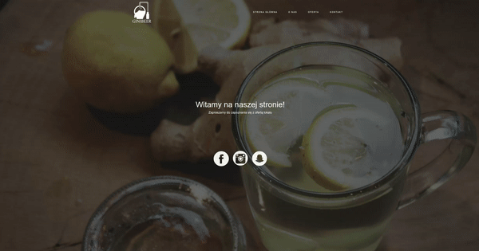

# 👶🏽 Ginibeer - School Project (2017)

## Description
Project for internship - "Create your own business". - logo and website are created for a fictional company. The website is a simple presentation page with.

## Technologies
This project was developed using HTML, CSS, JS and PHP

## Purpose of Publication
This codebase is published as a memento of my early days in programming. It's a snapshot of my learning journey and showcases the progress I've made since this initial foray into coding.

---

*This project is a documentation of my beginnings in the coding world and is published solely for archival purposes.*
